# GC 垃圾回收器

## 标记阶段

### 引用计数算法

引用计数算法(Reference Counting)比较简单，对每个对象保存一个整型的引用计数器属性。用于记录对象被引用的情况。

对于一个对象A，只要有任何一个对象引用了A，则A的引用计数器就加1; 当引用失效时，引用计数器就减1。只要对象A的引用计数器的值为0，既表示对象A不可能再被使用，可进行回收。

优点: 实现简单、垃圾对象便于标识; **判定效率高**，回收没有延迟性

缺点:

- 需要单独的字段存储计数器，这样增加类**存储空间的开销**
- 每次赋值需要更新计数器，伴随着加法和减法的操作，这增加了**时间开销**
- 引用计数器有一个严重的bug，既无法处理**循环引用**的情况。所以导致了Java的垃圾回收器中没有使用到这类算法(Python使用了)。

### 可达性分析算法（Tracing Garbage Collection）

相对于引用计数算法而言，可达性分析算法不仅同样具备实现简单和执行高效等特点，更重要的是该算法可以有效地解决在引用计数算法中循环引用的问题，防止内存泄漏的发生。
相较于引用计数算法，这里的可达性分析就是Java、C#选择的。这种类型的垃圾收集通常也叫作追踪性垃圾收集 (Tracing Garbage Collection)

所谓的“GC Roots”根集合就是一组必须活跃的引用。

基本思路：

- 可达性分析算法是以根对象集合 (GC Roots) 为起始点，按照从上至下的方式搜索被根对象集合所连接的目标对象是否可达
- 使用可达性分析算法后，内存中的存活对象都会被根对象集合直接或间接连接着，搜索所走过的路径称为引用链 (Reference Chain)
- 如果目标对象没有任何引用链相连，则是不可达的，就意味着该对象己经死亡，可以标记为垃圾对象。
- 在可达性分析算法中，只有能够被根对象集合直接或者间接连接的对象才是存活对象。

GC Roots包括以下几种元素:

- 虚拟机栈中引用的对象。比如: 各个线程被调用的方法中使用到的参数、局部变量等
- 本地方法栈内JNI(通常说的本地方法)引用的对象。
- 方法区中类静态属性引用的对象。比如: 字符串常量池(String Table)里的引用
- 所有被同步锁synchroized持有的对象
- Java虚拟机内部的引用。比如: 基本数据类型对应的Class对象，一些常驻的异常对象(NullPointerException、OutOfMemoryError)，系统类加载器
- 反映Java虚拟机内部情况的JMXBean、JVMTI中注册的回调、本地嗲码缓存等。
- 除了这些固定的GC Roots集合以外，根据用户所选用的垃圾收集器以及当前回收的内存区域不同，还可以有其他对象"临时性"地加入，共同构成完整的GC Roots集合。比如: 分代收集和局部回收♻️(Partial GC)。
  - 如果只针对Java堆中的某一块区域进行垃圾回收(如: 只针对新生代)，必须考虑到内存区域锁虚拟机自己的实现细节，更不是孤立封闭的，这个区域的对象完全有可能被其他区域的对象所引用，这时候需要一并将关联的区域对象也加入GC Roots集合中去考虑，才能保证可达性分析的准确性。
- 小技巧: 由于GC Root采用栈方式存放变量和指针，所以如果一个指针，它保存了堆内存里面的对象，但是自己又不存放在堆内存里面，它就是一个Root。

注意:

- 如果要使用可达性分析算法来判断内存算法可以回收，那么分析工作必须在一个能保障一致性的快照中进行。这点不满足的话分析结果的准确性就无法保证。
- 这点也是导致GC进行时必须要**Stop The World**的一个重要原因。
  - 即使号称(几乎)不会发生停顿的CMS收集器中，枚举根节点时也是必须要停顿的。

## 对象的finalization机制

Java语言提供了对象终止(finalization)机制来允许开发人员提供对象被销毁之前的自定义处理逻辑。

当垃圾收集器发现没有引用指向一个对象，既: 垃圾回收此对象之前，总会先调用这个对象的`finaliz()`方法。

`finalize()`方法允许在子类中被重写，用于在对象被回收时进行资源释放。通常在这个方法中进行一些资源释放和清理工作，比如关闭文件、套接字和数据库连接🔗等。

永远不要主动的调用某个对象的`finalize()`方法，应该交给垃圾回收器机制调用。理由如下:

- 调用`finalize()`方法可能导致对象复活
- `finalize()`方法的执行时间时没有保障的，它完全由GC线程决定，极端情况下，若不发生GC，则`finalize()`方法将引用不会执行。
- 一个糟糕的`finalize()`会严重影响GC的性能。

如果从所有的根节点都无法访问某个对象，说明对象已经不再使用了，一般来说，此对象需要被回收。但事实上，也并非"非死不可"的，这时候它们暂时处于"缓刑"阶段。一个无法触及的对象有可能在某一个条件下"复活"自己，如果这样，那么它的回收就是不合理的，为此，定义虚拟机中的对象可能的3中状态。如下: 

- 可触及的: 从根节点开始，可以到达这个对象。
- 可复活的: 对象的所有引用都被释放，但对象有可能在`finalize()`中复活。
- 不可触及的: 对象的`finalize()`被调用，并且没有复活，那么就会进入不可触及状态。不可触及的对象不可能复活，因为`finalize()`只会被调用一次。

以上3中状态中，是由于`finalize()`方法的存在，进行的区分，只有在对象不可触及时才可以回收。

## 清除阶段

当成功区分出内存中存活对象和死亡对象后，GC 接下来的任务就是执行垃圾回收，释放掉无用对象所占用的内存空间，以便有足够的可用内存空间为新对象分配内存。

目前在JVM中比较常见的三种垃圾收集算法是标记一清除算法( Mark-Sweep)
复制算法（ Copying ）、标记 一 压缩算法( Mark-Compact )

### 标记-清除算法(Mark-Sweep)

标记-清除算法（ Mark-Sweep）是一种非常基础和常见的垃圾收集算法，该算法被J.McCarthy等人在1960年提出并并应用于Iisp语言。
执行过程：
当堆中的有效内存空间 (available memory）被耗尽的时候，就会停止整个程序（也被称为stop the world），然后进行两项工作，第一项则是标记，第二项则是清除。

标记：Collector 到用根节点开始遍历，标记所有被引用的对象。一般是在对象的Header中记录为可达对象。
清除：Co1lector对堆内存从头到尾进行线性的遍历，如果发现某个对象在其Header中没有标记为可达对象，则将其回收。

缺点：

- 效率不算高
- 在进行GC的时候，需要停止整个应用程序，导致用户体验差。
- 这种方式清理出来的空闲内存是不连续的，产生内存碎片。需要维护一个空闲列表。

### 复制算法(Copying)

背景：

为了解决标记-清除算法在垃圾收集效率方面的缺陷，M.L.Minsky于1963年发表了著名的论文，“使用双存储区的Iisp语言垃圾收集器CA LISP Garbage Collector Algorithm Using Serial Secondary Storage )”。M.L.Minsky 在该论文中描述的算法被人们称为复制 (Copying）算法，它也被M.L.Minsky 本人成功地引入到了Lisp语言的一个实现版本中。
核心思想：
将活着的内存空间分为两块，每次只使用其中一块，在垃圾回收时将正在使用的内存中的存活对象复制到未被使用的内存块中，之后清除正在使用的内存块中的所有对象，交换两个内存的角色，最后完成垃圾回收。

优点：

- 没有标记和清除过程，实现简单，运行高效。
- 复制过去以后保障空间的连续性，不会出现“碎片”问题。

缺点：

- 此算法的缺点也是很明显的，就是需要两倍的内存空间。
- 对于G1这种分拆标成为大量region的GC，复制而不是移动，意味着GC需要维护region之间对象引用关系，不管是内存占用或者时间开销也不小。

特别的：

- 如果系统中的垃圾对象很少，复制算法就不会很理想。复制算法需要复制的存活对象数量并不会太大，或者说非常低才行。

应用场景：

在新生代，对常规应用的垃圾回收，一般通常可以回收70%-99%的内存空间。回收性价比很高。所以现在的商业虚拟机都是这种收集算法回收新生代。

### 标记-压缩算法或标记-整理（Mark-Compact）

背景：
复制算法的高效性是建立在存活对象少、垃圾对象多的前提下的。这种情况在新生代经常发生，但是在老年代，更常见的情况是大部分对象都是存活对象。如果依然使用复制算法，由于存活对象较多，复制的成本也将很高。因此，基于老年代垃圾回收的特性，需要使用其他的算法。

标记-清除算法的确可以应用在老年代中，但是该算法不仅执行效率低下，而且在执行完内存回收后还会产生内存碎片，所以JVM 的设计者需要在此基础之上进行改进。标记压缩 (Mark Compact）算法由此诞生。

1970 年前后，G. L.Steele、 C.J.Chene 和D.S．Wise 等研究者发布标记压缩算法。在许多现代的垃圾收集器中，人们都使用了标记-压缩算法或其改进版本。

执行过程：

第一阶段和标记-清除算法一样，从根节点开始标记所有被引用的对象。

第二阶段将所有的存活对象压缩到内存的一端，按顺序存放。

之后，清理边界外所有的空间。

标记-压缩算法的最终效果等同于标记-清除算法执行完成后，再进行一次内存碎片整理，因此，也可以把它称为**标记-清除-压缩 (Mark-Sweep-Compact)算法**。

二者的本质差异在于标记-清除算法是一种**非移动式的回收算法**，标记-压缩是**移动式**的。是否移动回收后的存活对象是一项优缺点并存的风险决策。

可以看到，标记的存活对象将会被整理，按照内存地址依次排列，而未被标记的内存会被清理掉。如此一来，当我们需要给新对象分配内存时，JVM只需要持有一个内存的起始地址即可，这比维护一个空闲列表显然少了许多开销。

指针碰撞（Bump the Pointer）

如果内存空间以规整和有序的方式分布，即己用和未用的内存都各自一边，彼此之间维系着一个记录下一次分配起始点的标记指针，当为新对象分配内存时，只需要通过修改指针的偏移量将新对象分配在第一个空闲内存位置上，这种分配方式就叫做指针碰撞 (Bump the Pointer)。

优点：

- 消除了标记-清除算法当中，内存区域分散的缺点，我们需要给新对象分配内存时，JVM只需要持有一个内存的起始地址即可。

- 消除了复制算法当中，内存减半的高额代价。

缺点：

- 从效率上来说，标记-整理算法要低于复制算法。
- 移动对象的同时，如果对象被其他对象引用，则还需要调整引用的地址。
- 移动过程中，需要全程暂停用户应用程序。即：STW

## 分代收集算法

## 增量收集算法、分区算法

