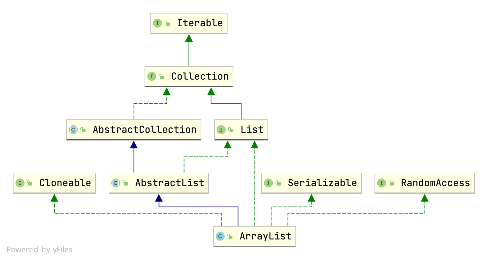

# ArrayList

- [ArrayList源码](../../../../../src/java.base/share/classes/java/util/ArrayList.java)
- [ArrayList测试用例](../../../test/java/cool/intent/java/util/ArrayListTest.java)



## 问题

### ArrayList的默认数组大小为什么是10？

    据说是因为sun的程序员对一系列广泛使用的程序代码进行了调研，结果就是10这个长度的数组是最常用的最有效率的。
    也有说就是随便起的一个数字，8个12个都没什么区别，只是因为10这个数组比较的圆满而已。

### ArrayList中的`elementData`为什么是 Object 而不是泛型 E ？

    Java 中泛型运用的目的就是实现对象的重用，泛型T和Object类其实在编写时没有太大区别,
    只是JVM中没有T这个概念，T只是存在于编写时,进入虚拟机运行时,虚拟机会对泛型标志进行擦除，
    也就是替换T会限定类型替换（根据运行时类型）,如果没有限定就会用Object替换。
    同时Object可以new Object()，就是说可以实例化，而T则不能实例化。
    在反射方面来说，从运行时,返回一个T的实例时,不需要经过强制转换,然后Object则需要经过转换才能得到。

### ArrayList的扩容机制？

    扩容为原来的(1.5倍 + 1)的大小
    主要代码是这句，计算了新容器的大小，oldCapacity = size + 1：
    int newCapacity = oldCapacity + (oldCapacity >> 1);
    假如原来的大小为默认的10，那么扩容之后就是：
    int oldCapacity = size + 1; // 10 + 1 = 11
    int newCapacity = oldCapacity + (oldCapacity >> 1);// 11 + (11 >> 1) = 11 + 5 = 16
    如果再扩容就是：
    int oldCapacity = size + 1; // 16 + 1 = 17
    int newCapacity = oldCapacity + (oldCapacity >> 1);// 17 + (17 >> 1) = 17 + 8 = 25

### new ArrayList(20); 中的list扩充几次？

    默认ArrayList的长度是10个，所以如果你要往list里添加20个元素肯定要扩充一次（newCapacity 扩充为原来的1.5倍，
    但和输入的minCapacity相比发现小于minCapacity，
    于是 newCapacity = minCapacity，所以只扩容一次，具体见扩容里的grow方法），
    但是这里显示指明了需要多少空间，所以就一次性为你分配这么多空间，也就是不需要扩充了！

### 为什么ArrayList实现了RandomAccess接口？

    只要List集合实现这个接口，就能支持快速随机访问，然而又有人问，快速随机访问是什么东西？有什么作用？
    查看源码：

```java
import java.util.List;

/**
 * {@link java.util.Collections#binarySearch(List, Object)}
 * {@link java.util.AbstractList#subList(int, int)}
 */
public class Test {
} 
```

    通过查看源代码，发现实现RandomAccess接口的List集合采用一般的for循环遍历，而未实现这接口则采用迭代器。
    RandomAccess接口这个空架子的存在，是为了能够更好地判断集合是否ArrayList或者LinkedList，
    从而能够更好选择更优的遍历方式，提高性能！

### ArrayList能不能在for循环中删除元素？

    不能！因为：
    {@link ArrayList#remove(int)}
    里面的System.arraycopy方法是将该元素从数组中删除，并且将后一个元素移动至当前位置，
    导致下一次循环遍历时后一个字符串并没有遍历到，所以无法删除。
    解决办法是使用倒序删除或者迭代器删除。

### ArrayList使用for循环和迭代器哪个快？

    测试结果：
    ArrayList For: 3
    ArrayList Iterator: 2
    LinkedList For: 1610
    LinkedList Iterator: 3
    ArrayList用for循环遍历和iterator迭代器差不多，LinkedList用iterator迭代器遍历比for循环遍历快

### ArrayList 的插入删除一定慢么？

    取决于你删除的元素离数组末端有多远，ArrayList拿来作为堆栈来用还是挺合适的，push和pop操作完全不涉及数据移动操作。